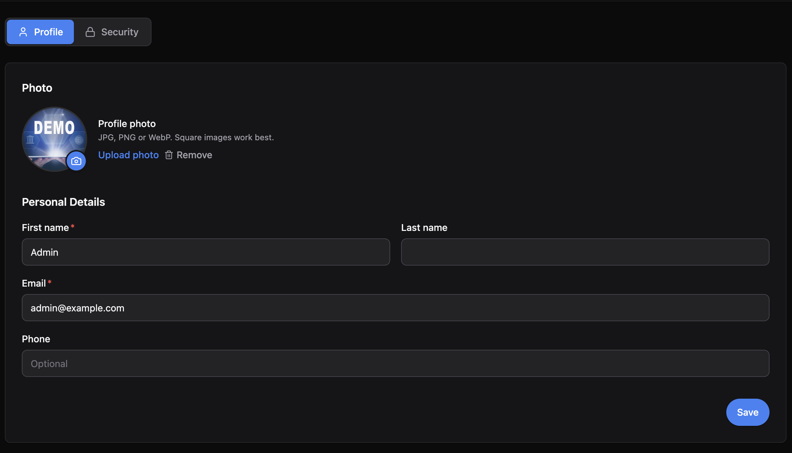
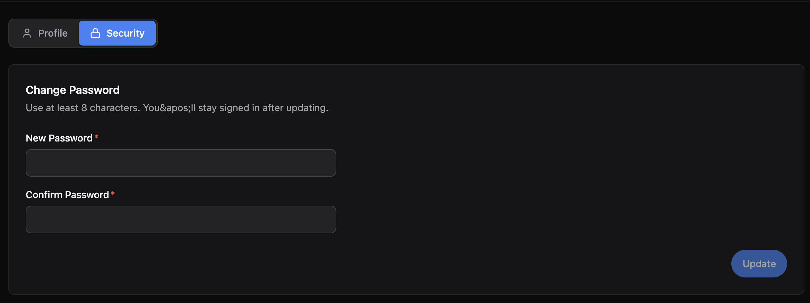

# @maxal_studio/kratosjs-plugin-profile

Adds a **Profile** page to a KratosJs admin panel where the logged-in user can edit
their own details (name, email, phone, avatar) and change their password. Works on
both MongoDB and SQL.





## Install

```bash
npm install @maxal_studio/kratosjs-plugin-profile
```

## Register

**Server** (`src/index.ts`):

```ts
import { ProfilePlugin } from "@maxal_studio/kratosjs-plugin-profile";

Panel.make("admin")
  // ...
  .plugins([new ProfilePlugin()]); // uses the 'User' entity by default
```

If your user entity isn't named `User`:

```ts
new ProfilePlugin({ userEntity: "Account" });
```

**Client** (`src/admin/main.tsx`):

```ts
import profile from "@maxal_studio/kratosjs-plugin-profile/client";

mountAdminPanel({ plugins: [profile] });
```
